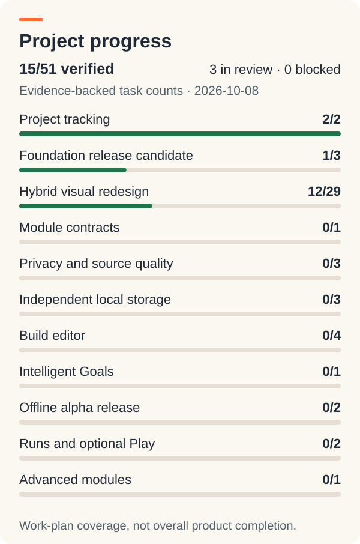
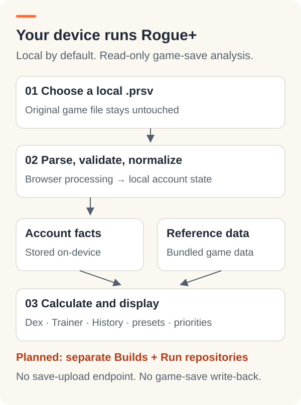

<p align="center">
  
</p>

# Rogue+

**Know what you have. Plan what to build. Track what matters next.**

A mobile-first, local-first PokéRogue companion. Explore an imported collection, review progression and compare source-backed strategy presets. Your device processes the data; the website distributes the application.

[Open companion](https://rogue-plus.gagedush-bff.workers.dev/) · [Design preview](https://design-hybrid-shell-v1-rogue-plus.gagedush-bff.workers.dev/) · [Project status](docs/STATUS.md) · [AI start here](AGENTS.md)

> **Current scope:** read-only local save analysis and Rogue+ backups. Profiles, editable Builds and Run management are future work. Optional Guest Play is an independent experiment.

<!-- PROJECT:START -->
## Project progress

9 / 43 tracked tasks verified. Counts describe this work plan, not overall product completion.

| Verified | In progress | Ready for review | Blocked | Planned |
| --- | --- | --- | --- | --- |
| ✓ 9 | ◐ 0 | ◇ 3 | ! 0 | ○ 31 |

<details>
<summary>View milestone progress illustration</summary>



</details>

<details>
<summary>Milestone checklist</summary>

| ID | Milestone | Verified/total |
| --- | --- | --- |
| T | Project tracking | 2/2 |
| A | Foundation release candidate | 1/3 |
| B | Hybrid visual redesign | 6/21 |
| C | Module contracts | 0/1 |
| D | Privacy and source quality | 0/3 |
| E | Independent local storage | 0/3 |
| F | Build editor | 0/4 |
| G | Intelligent Goals | 0/1 |
| H | Offline alpha release | 0/2 |
| I | Runs and optional Play | 0/2 |
| J | Advanced modules | 0/1 |

</details>

**Explore:** [Status](docs/STATUS.md) · [Roadmap](docs/ROADMAP.md) · [Next task](docs/NEXT_TASK.md) · [File map](docs/FILE_MAP.md)

**How to read this:** ✓ verified · ◐ in progress · ◇ review · ○ planned. Verification and production release are recorded separately.
<!-- PROJECT:END -->

## Find your way

| Looking for… | Start here |
| --- | --- |
| What works, what is pending, and release checks | [Project status](docs/STATUS.md) |
| Goals, task dependencies, and acceptance criteria | [Roadmap](docs/ROADMAP.md) |
| The next authorized work packet | [Next task](docs/NEXT_TASK.md) |
| System boundaries and actual tracked files | [System & file map](docs/FILE_MAP.md) |
| Accepted product decisions and visual proposals | [Decisions](docs/DECISIONS.md) · [Design reference](docs/DESIGN.md) |
| How AI work updates progress | [Completion workflow](docs/PROJECT_WORKFLOW.md) |

## What stays on your device



Read a local `.prsv`, validate and normalize supported fields, then use on-device collection data with pinned references. No Rogue+ save-upload endpoint, re-encryption or game-save write-back. Local Rogue+ backup export/restore remains supported.

<details>
<summary>Source ownership and game references</summary>

| Source | Responsibility |
| --- | --- |
| This repository | Application, build tooling, public reference pins and generic presets |
| Pinned PokéRogue source | Game IDs, starter costs and supported rule definitions |
| Build pipeline | Validated bundled references; currently 572 starter roots |
| User's browser | Normalized private account state and local backups |

The starter catalog is generated by `scripts/generate-game-references.mjs`. Other mechanics/assets remain identified versioned snapshots until their extractors are validated. Future account/run/UserContent separation is planned, not already shipped. See [data sources](docs/DATA_SOURCES.md) and [architecture](docs/ARCHITECTURE.md).

</details>

## Develop locally

```bash
cd companion
npm install
npm run dev
```

First development/build setup needs network access to generate pinned references. Full offline installation and update behavior remains a release verification task.

<details>
<summary>Branch guide and independent previews</summary>

| Branch | Purpose |
| --- | --- |
| `main` | Production companion baseline |
| `alpha/companion-foundation` | Extracted screens and safeguards; draft PR #2 |
| `design/hybrid-shell-v1` | Canonical five-tab shell; draft PR #3 |
| `chore/project-tracking-2026-10-08` | Generated project reports and documentation; draft PR #5 |
| `alpha/play-integration` | Separate Guest Play/Damage Preview prototype; draft PR #1 |

Cloudflare Workers is authoritative. The old AppDeploy deployment and unused Pages project are historical. Preview origins have independent browser-local state. Draft work is not automatically production functionality.

</details>

## Privacy & attribution

Use synthetic fixtures for public checks. Never commit actual player saves, private account history/backups, trainer secrets or private screenshots. Pinned game source/artwork retain their own licensing and attribution requirements. See [privacy guidance](docs/PRIVACY.md).

The documentation header uses the supplied clean R+ mark unchanged. Its framing and diagrams are documentation illustrations, not approval of an application redesign.
