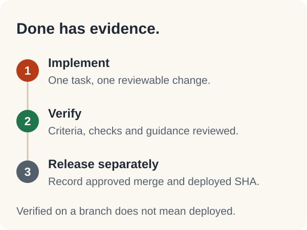

# Rogue+ · Next task

[Overview](../README.md) · [Status](STATUS.md) · [Roadmap](ROADMAP.md) · [Next task](NEXT_TASK.md) · [File map](FILE_MAP.md)

<!-- Generated by scripts/project-tracking.mjs. Edit project/tasks.json, not this report. -->

> **Active work:** None recorded.

## Ready for review

| Task | Work packet | Review |
| --- | --- | --- |
| BASE-FOUND | Review existing foundation extraction | [Open PR](https://github.com/GageDush/Rogue-Plus/pull/2) |
| BASE-SHELL | Review existing canonical hybrid shell | [Open PR](https://github.com/GageDush/Rogue-Plus/pull/3) |
| D0 | Public-source and reachable-history review | design/profile-candy-overview |

## Dependency-ready tasks

| Task | Work packet | Implementation approval |
| --- | --- | --- |
| U2 | Shell, navigation and authentic branding | pending |
| U4B | Pokemon detail composition | pending |
| U8 | Settings and persistent recovery feedback | pending |
| C0 | First narrow companion module contract | pending |
| I0 | Lock dependencies and reproducible CI | pending |
| V0 | Profile/Run/UserContent schema contracts | pending |
| REF0 | Rules-legal Build reference coverage | pending |
| DEX-SEARCH | Advanced search and available-option matching | pending |
| DEX-CANDY | Verified candy eligibility and reserve budgets | pending |

> Dependency-ready does not mean authorized. Select an approved packet, record it as in_progress, and set activeTask.

## Blockers

No tasks explicitly marked blocked. Pending approval and untested release checks remain separate.

## Completion path

[Agent instructions](../AGENTS.md) · [Development workflow](PROJECT_WORKFLOW.md) · [Decisions](DECISIONS.md)
