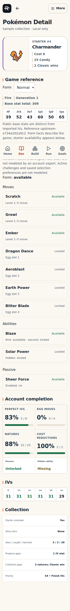
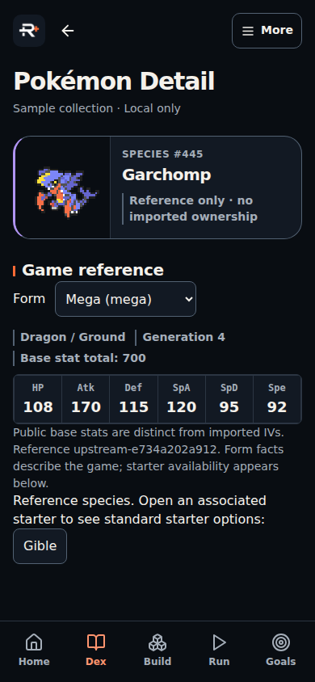
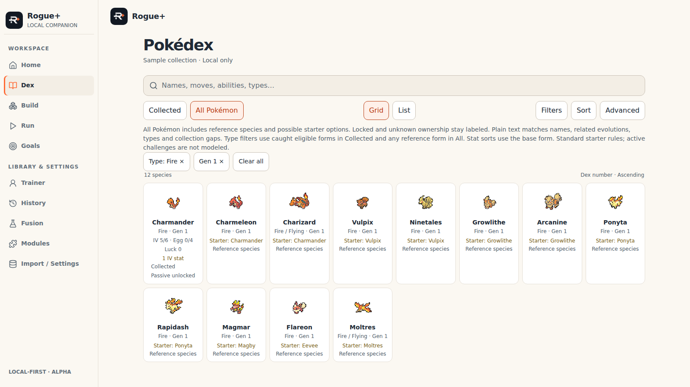

# DEX-REF-INTEGRATE — populated reference facade and Dex UI

Authorized packet 8, GPT-6.1 Medium, 2026-10-09. User explicitly approved packets 7–8 including UI integration and publication after validation. Packets 3–6 remote baseline c147515; packet 7 independently committed before this packet. No merge or production deployment. project/tasks.json remains the only status ledger.

## Implemented boundary

The generated pinned public pack/index is exported and projected through domain/dex-catalog.ts into the existing facade. All Pokémon contains 1,084 public species and preserves imported IDs outside coverage. Collected requires an imported unlocked starter. Public reference rows never become imported ownership, history, strategy readiness, candy recommendations or backup content. Existing starter roster shape, game/assets/locale pins, importer/storage/scoring and other feature owners remain unchanged.

Cards expose base-form types/generation and explain related-species/option matches. Detail exposes public forms, six base stats/BST separate from imported IVs; nonstarters link to associated starters. Standard starter moves, ordinary/hidden ability slots and passive have available/locked/ownership-unknown labels. Passive enabled is separate from unlocked; aliased ability names retain slot states. Ineligible forms show no playable options. Missing/invalid source masks and mismatched reference revisions remain unknown.

Type/generation filters use the same disposable draft panel (OR within each group, AND across groups/other conditions). Collected type filters use caught eligible forms; All uses any reference form. Generation/BST/base-Speed sorts use public base-form facts; numeric unknowns remain last. Plain text matches names/related evolution names/base types/gaps and named starter options; Collected requires available options, All labels locked/unknown possibilities. No expression grammar, condition/evolution eligibility engine, candy reserve or runtime pack updates. Original Dex query/layout/reveal/scroll/card focus survives detail and associated-starter navigation.

## Actual acceptance

- 72 application tests pass; six new catalog/query/render cases cover reference-only and guest data, no mutation, roots, available-vs-possible move search, revision mismatch, missing source, type/generation grouping, base-stat sorting, imported ranges and detail ownership separation. Existing 66 tests retain artwork/import/storage/recovery/candy/query/theme contracts.
- 12 Node static-extraction tests pass. Fresh pinned regeneration produces 572 starter records, 1,084 species / 1,500 forms without executing downloaded game code. TypeScript and final production Vite build pass.
- Eight existing Dex browser cases pass at 320×720, 390×844, 1100×390 and 1600×900 in both themes: grid/list/scope, partial/long/empty data, drafts/ranges, focus, detail/menu returns and simulated landscape insets. All-scope locked fixture now searches Nincada explicitly because the complete catalog places that imported record beyond the first batch.
- Eight reference browser cases pass at the same sizes/themes: locked Bitter Blade excluded in Collected and labeled in All, detail option/passive states, base stats, Garchomp Mega form/BST, Gible association/unknown ownership, associated-starter return focus, type/gen Apply versus Cancel, applied chips, stat sort and no horizontal overflow/clipped title/client errors.
- Theme/lifecycle and actual startup recovery browser suites pass at 320/390/1330 across five primary routes, including live OS changes, rejected-byte preservation, retry/reload/cancel/reset and keyboard controls. Final production desktop/mobile navigation, IndexedDB reload and isolated synthetic backup/restore also pass.
- Existing artwork fixture passes four sizes/themes with 15 requests each spanning nine generations, forms and shiny tiers, actual CORS-compatible pinned PNG pixels, and forced JSON/PNG failures. Final reference screenshots also show authentic Charmander and Mega Garchomp artwork. Workspace proxy certificate accommodation is test-only; application transport is unchanged.
- Module boundaries, tracked-source validator, whitespace, tracking regeneration/15 tests/freshness pass before commit. CI adds the two Dex matrices against a private source-fixture server alongside existing production-preview checks.

Visual inspection found and fixed 320px title clipping and legacy microtext on newly exposed reference facts. Representative sanitized screenshots below contain only synthetic fixtures; full-page screenshots are composition evidence, not physical-device interaction evidence.

## Consumers, guidance and limits

Reviewed Home/Build/Run/Goals/Trainer/History/Fusion/Modules/import settings consumers, shared facade/artwork/navigation, backup/recovery and query contracts. Reviewed AGENTS; updated DEX_HANDOFF, DATA_SOURCES, ARCHITECTURE, DESIGN, DECISIONS and reference README. Final guidance closure removes the stale materialized-workspace recovery claim and obsolete next-U4A instructions; current source is the real synced checkout and downstream tasks remain pending approval. No second status ledger or private saves/backups/secrets in this packet.

Final production JS is 2,697.50 kB / 326.58 kB gzip; Vite reports its chunk-size warning. Full bundled reference increases startup payload; splitting/remote-pack architecture is a later packet. Two unnamed official ability placeholders remain excluded with explicit partial coverage. Active challenges/Fresh Start, saved starter preferences, arbitrary later moves/evolution conditions, all-form artwork coverage, physical installed Safari/iPhone and offline/release parity are not claimed. Runtime remains bundled-only and standard-account compatibility stays pinned.

Publication uses structured GitHub tree/commit/ref operations with an explicit path list, exact local tree comparison and expected remote head because shell Git lacks write credentials. The user has authorized publication. Final remote head and CI outcomes are recorded in PR #8; local acceptance and PR publication do not imply merge/deployment.
